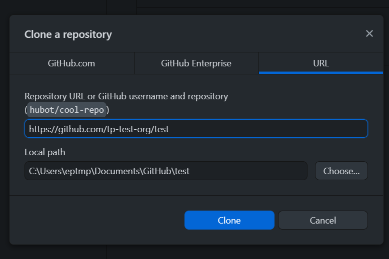

# Git and GitHub Workflow

```{r setup, include=FALSE}
knitr::opts_chunk$set(echo = FALSE, fig.align = "center")
```

## Standard GitHub workflow

- (I recommend to only fork a public repo if you intend to send a pull request to it)
- Fork the other person's repo (this will be known as the `upstream` repo from your fork, your copy of a repo on GitHub is known as `origin`)
- This creates a copy of their repo under your account (your fork)
- Clone your fork (the copy under your account) to your machine
- Create a new branch (do not work on `master`/`main`)
- Make your changes and commit them
- Push your new branch upto your GitHub (i.e., to your fork)
- Create a pull request (from your new branch) back to the default (`master`/`main`) branch of the original repo

## Workflow with an OpenSAFELY GitHub repo

- Skip the forking step from the standard GitHub workflow
- The repo on GitHub is known as `origin`
- Clone the repo to your local machine
  - Click: `Code` | `Open with GitHub Desktop`  
    ```{r}
    knitr::include_graphics("img/tp-test-org_test-code-button-owgd.png")
    ```  
  - Click `Clone` in the box which appears in GitHub Desktop  
    ```{r, out.width = "65%"}
    
    ```  
  - Go to the Making a pull request page [here](05-making-pull-request.html)
