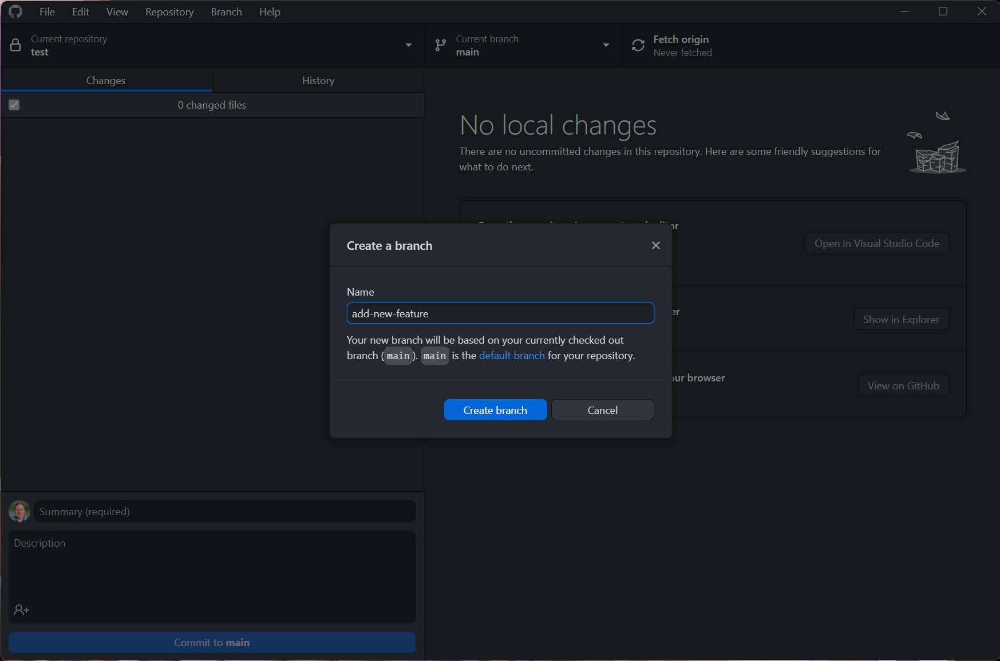
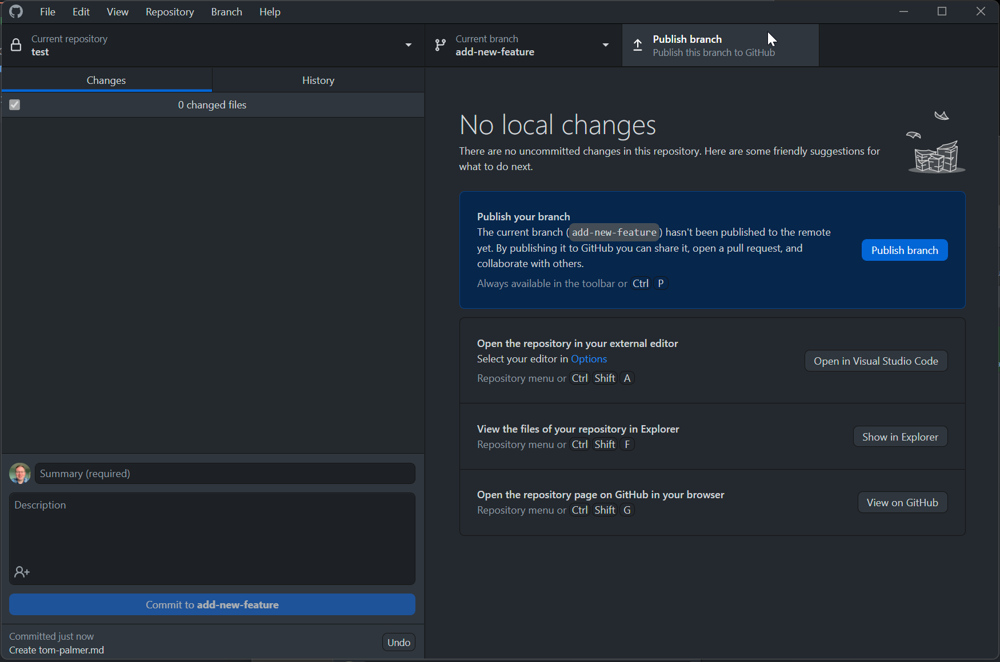
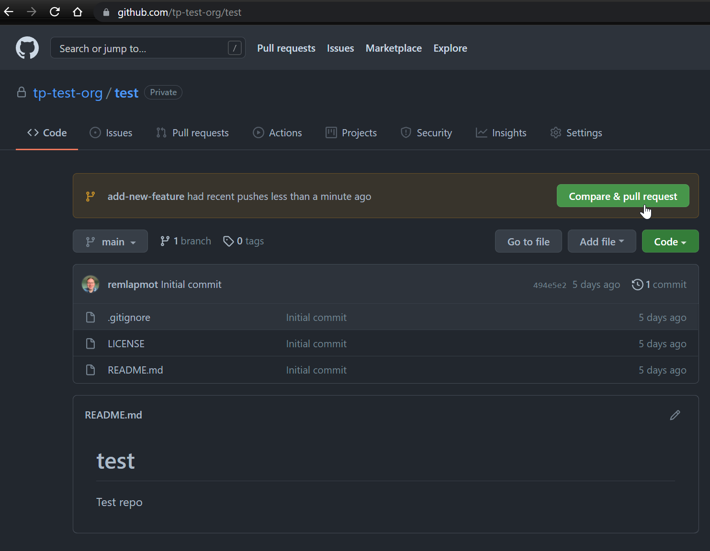
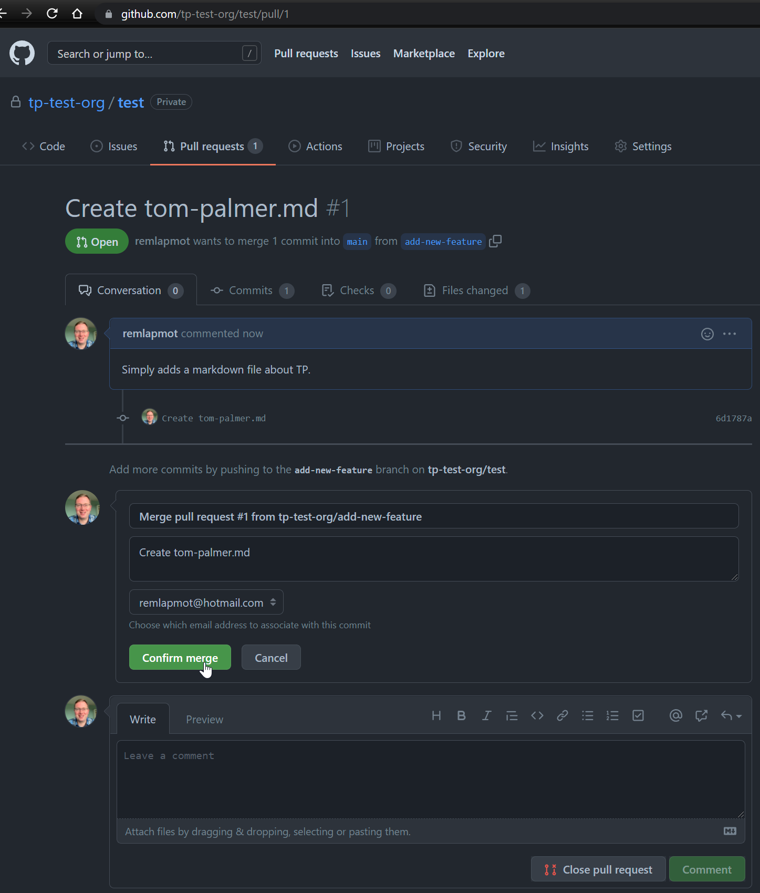

# Making a pull request

- Let's start by creating a new branch  
<!-- -->
- We do some work (in VSCode/text editor/RStudio) which creates a markdown file with a title and some text. We then make a new commit which adds this new file to the repo  
<!-- -->
- Next publish the new branch to GitHub  
<!-- -->
- Now initiate the creation of the PR by either clicking in GitHub Desktop "Create Pull Request" 
<!-- -->
- or clicking on the button on the repo webpage "Compare & pull request"  
<!-- -->
- Edit the title box, add some extra text in the comment box, select a reviewer, and then click "Create pull request"  
<!-- -->
- You can amend/edit pull requests by modifying/adding commits to the branch from which you sent the PR
- See more about pull request reviews [here](https://docs.github.com/en/github/collaborating-with-pull-requests/reviewing-changes-in-pull-requests/about-pull-request-reviews)
- (The reviewer) will then merge your PR  
<!-- -->
- (The reviewer) will then confirm the merge  
<!-- -->
- (Optional) Delete the branch the PR came from  
<!-- -->
- The PR is now finished and we can see the merge commit in the default (`main`/`master`) branch
<!-- -->
- In GitHub Desktop click "Fetch origin"/"Pull origin" to pull the updated `main`/`master` branch down to your local machine ... and the process begins again ...
