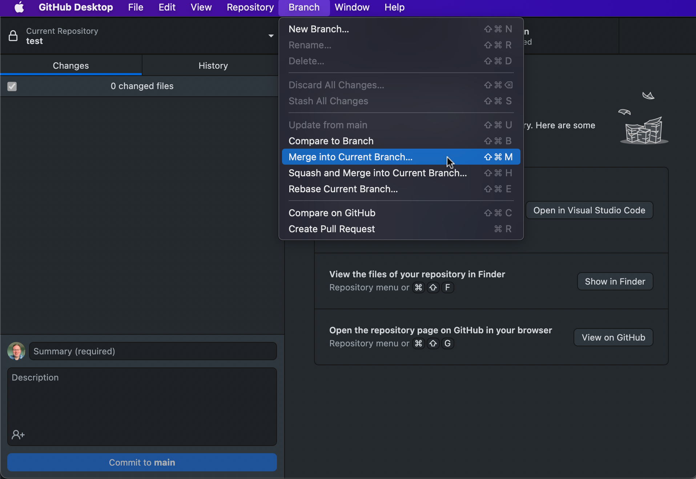
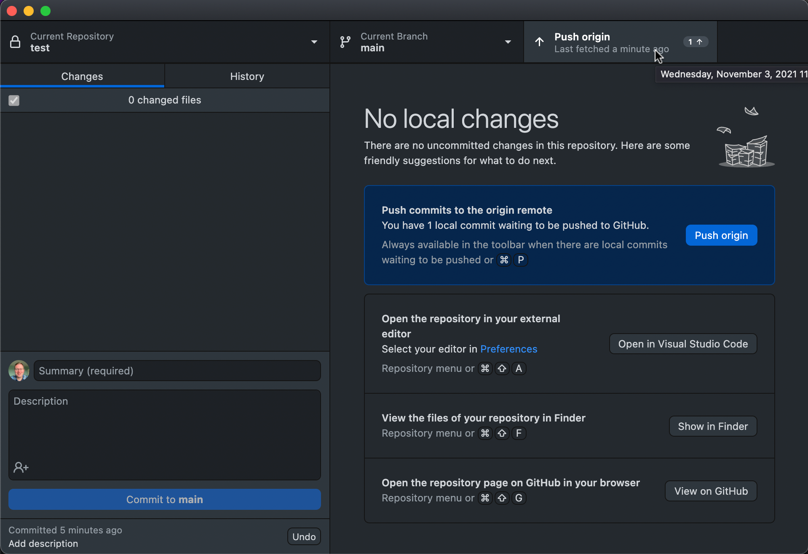
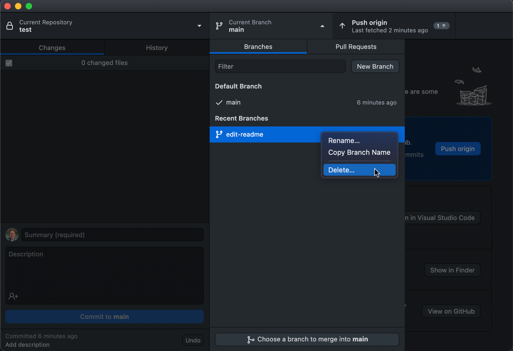

# Merging a branch locally

- A PR is essentially doing a merge on GitHub, you can merge branches locally as well
- Say we created a new branch `edit-readme` and made a commit on it
- To merge `edit-readme` into `main` switch to `main`  
<!-- -->
- Select `edit-readme` and click "Create a merge commit"
<!-- -->
- Then push the new commits onto `main` upto GitHub (when appropriate)
<!-- -->
- Then you can delete the `edit-readme` branch  
<!-- -->
- Confirm the deletion
<!-- -->
