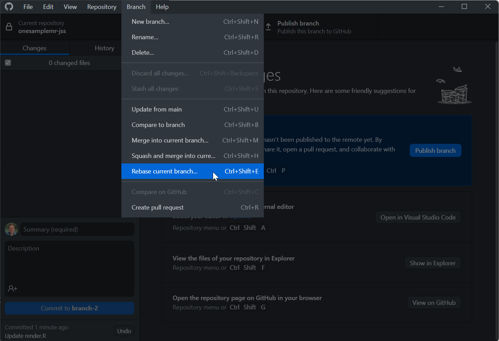
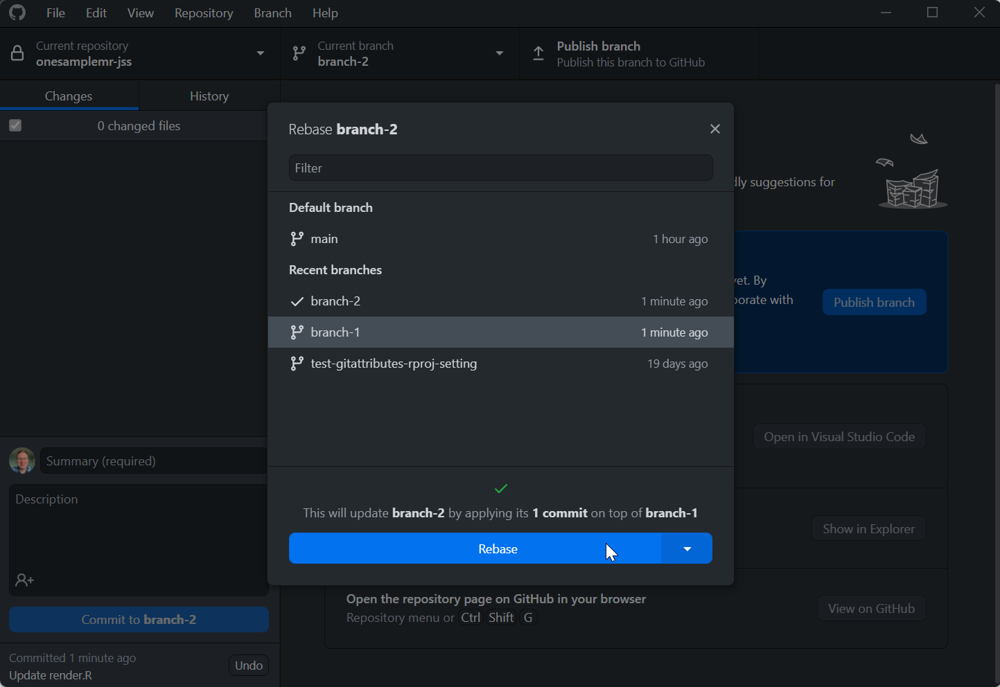
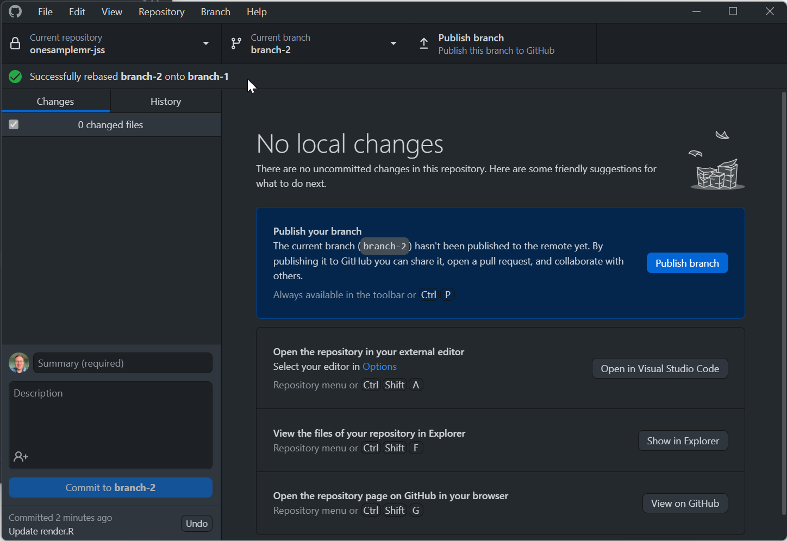

# Rebasing a branch

* Performing a rebase puts the commits you have on your branch on top of the commits from another branch
* We commonly do this when our colleagues have merged PRs into say the `main` branch
* We would then rebase our branch on top of `main`
* A rebase can be performed in GitHub Desktop as follows
  * In these screenshots we assume we started working on `branch-1`
  * We then made `branch-2` from `branch-1` and made some commits on it
  * We then went back to `branch-1` and made some different commits
  * We now need to rebase the commits on `branch-2` to be on top of `branch-1`
  * Starting on `branch-2`, select *Branch | Rebase current branch...*  
    
  * Or/then from the middle panel select the branch to rebase on top of - select `branch-1` (or select `main` if you are rebasing on top of main) and click *Rebase*  
    
  * Hopefully the rebase will be successful, if there are merge conflicts you will need to resolve those  
    
