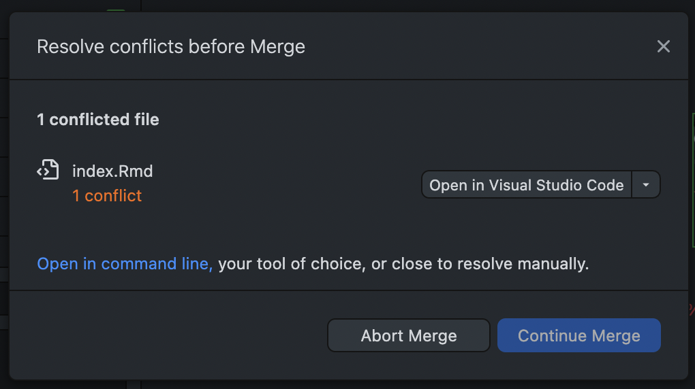
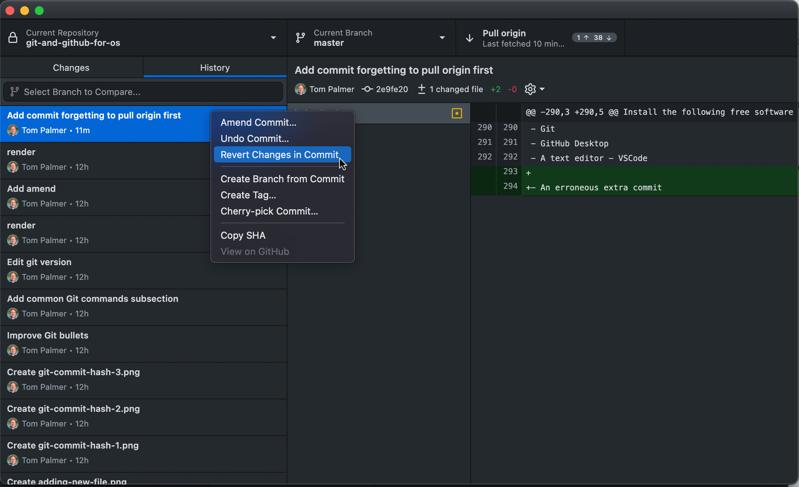
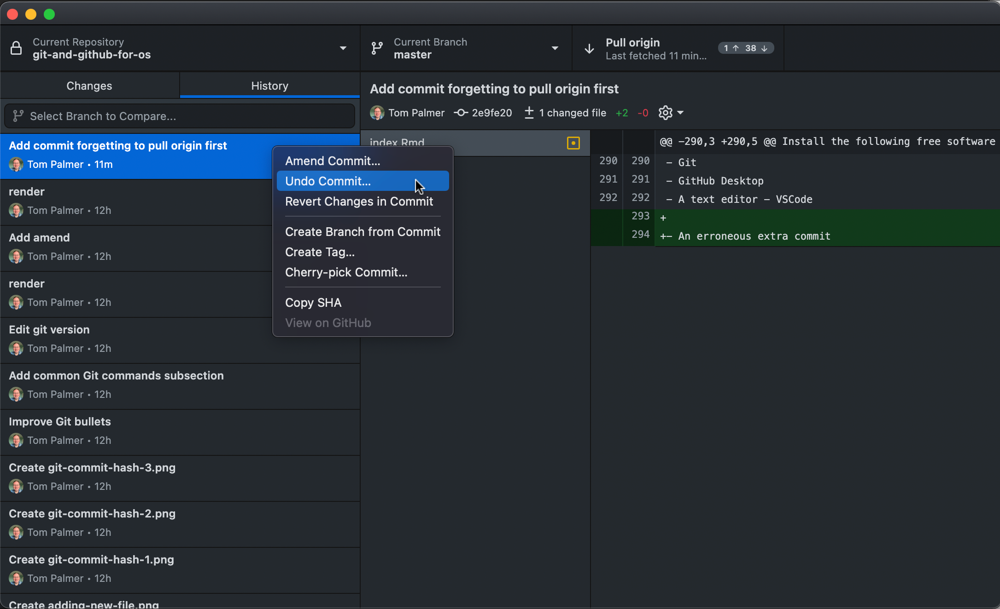
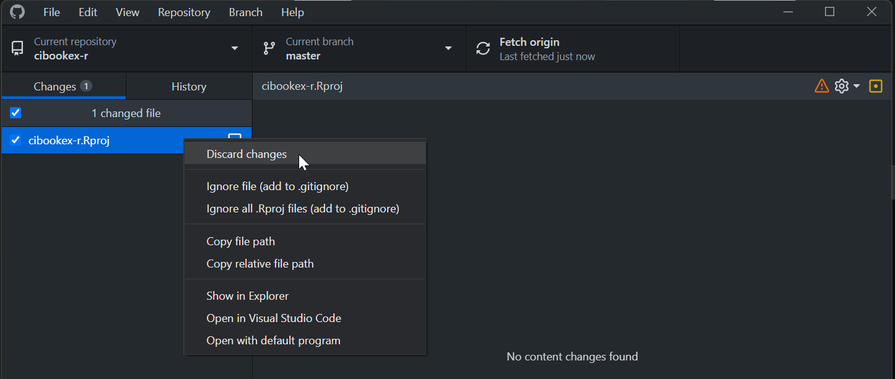

# Common errors


## Merge conflicts

* These can happen if e.g., 
  - you forget to pull down the latest changes from GitHub (I find easy to forget in the morning)
  - if you're working on a project with multiple people
    - you both create new branches
    - they send in their PR first and it's merged
    - then you send in your PR which edits some of the same lines
* Let's say I made changes yesterday which I pushed to GitHub
  - The next day I restart work on a different computer, GitHub Desktop will show for example  
    
- But you forget to click "Pull origin"
- If you make commits onto a branch on which there are not yet pulled commits on GitHub you'll get a merge error when you eventually click "Pull origin"  

- You could resolve conflict e.g., in VSCode  

- We can see this can happen when we see both up and down arrows in Pull origin box (but not always)  

* Fix
  - Move your changes to a new branch  
    
  - Move back to `master`/`main` and revert/undo the changes there, then edit the files so they show no changes  
    
    
    
  - Pull down the changes from GitHub to the relevant branch  
    
  - Merge changes from your new branch into the `main`/`master`/relevant branch
- See the GitHub documentation for more information about merge conflicts
  - [here](https://docs.github.com/en/github/collaborating-with-pull-requests/addressing-merge-conflicts/about-merge-conflicts)
  - Resolving a merge conflict [here](https://docs.github.com/en/github/collaborating-with-pull-requests/addressing-merge-conflicts/resolving-a-merge-conflict-on-github)

## No content changes found

- If you see the following message from Git that a file has changed but there are *No content changes found*  
    

- This is most likely caused by working with colleagues using different operating systems, because they save text files with different line ending characters (`CRLF` on Windows, `LF` on macOS/Linux/Unix)

- You can usually simply right click on the offending file in GitHub Desktop and *Discard changes*  
    
- Additionally you can set the following option at the top of your `.gitattributes` file

    ```  
    # Auto detect text files and perform LF normalization
    * text=auto
    ```  
