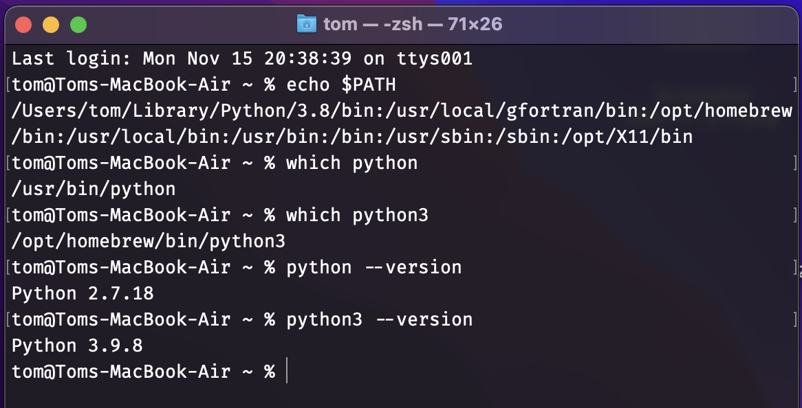
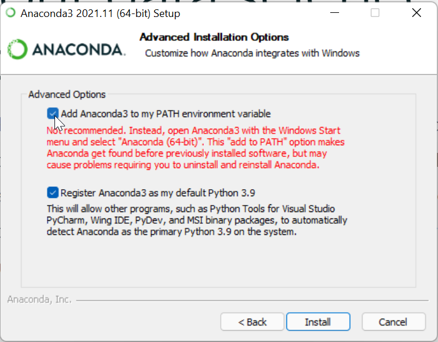
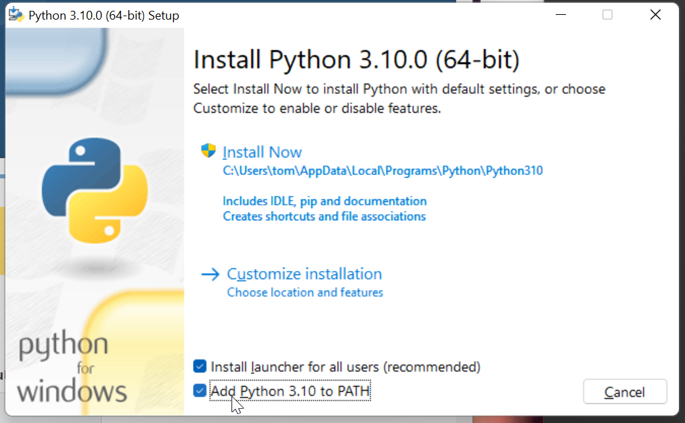
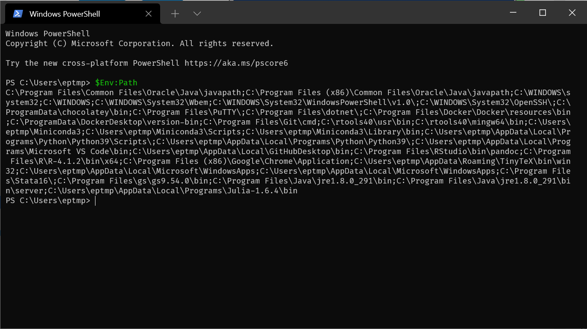
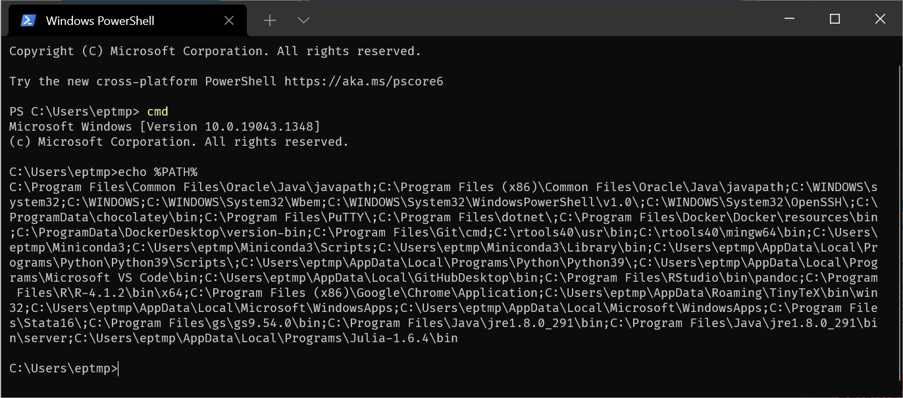
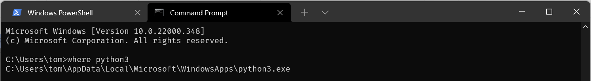
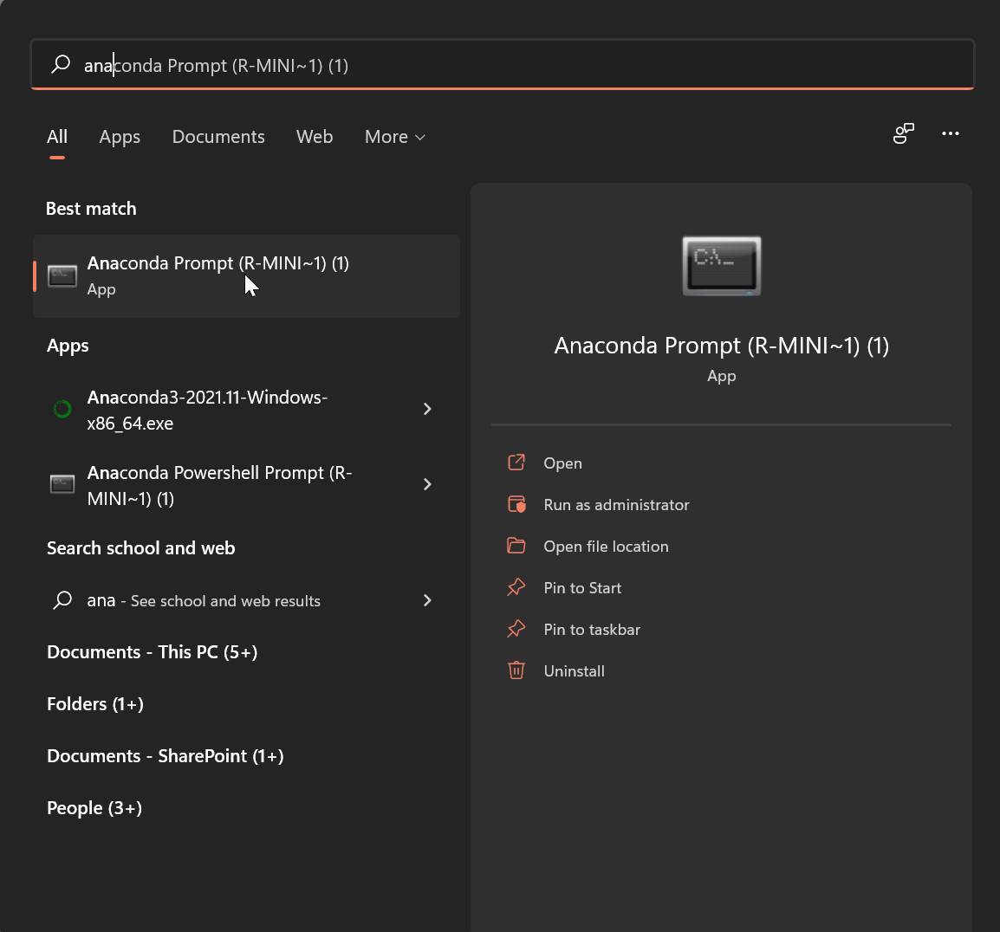
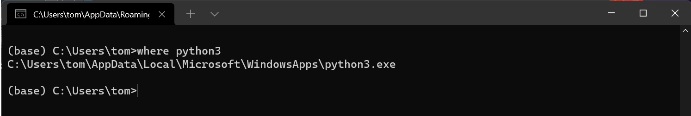

# Installing Python and the opensafely command line interface


- Environment variables in computer operating systems contain important strings of text
- The `PATH` environment variable is a list of folders which the computer searches in when you type the name of an executable into the command line shell program (usually `zsh` on macOS, `bash` on Ubuntu, `cmd` or `Powershell` on Windows)
- To use the `python`/`python3` and `pip`/`pip3` commands at the shell command line we need to install Python and make sure the folder containing its executable is in our `PATH` environment variable (unless you already know all of this and are going to run Python in Anaconda through the Anaconda Prompt)

## macOS

- If you have a Mac, the macOS operating system comes with an old-ish version of Python 2.7
- I recommend installing Python 3 through [homebrew](https://brew.sh/)  
    ```
    brew install python
    ```  
- When you open Terminal 
  - See the contents of `PATH` with `echo $PATH` (note use `${PATH}` in shell scripts)
  - you should be able to find the `python`/`python3` exectables with the `which` command
    <!-- -->

## Windows

- You have a number of choices where to install Python from  
  - Microsoft store, .e.g. Python 3.10 from [here](https://www.microsoft.com/store/productId/9PJPW5LDXLZ5)
  - Python installer from [here](https://www.python.org/downloads/)
  - Anaconda installer from [here](https://www.anaconda.com/products/individual)
- Despite not being recommend - it is better for you to add Anaconda/Python to your `PATH` in the installer options, i.e., check the first box on this screen  
    <!-- -->
  - And in the Python installer check the box adding Python to `PATH`  
    <!-- -->
- Open Windows Terminal
  - you can see the contents of `PATH` in Powershell with `$Env:Path`  
    <!-- -->
  - and in `cmd` with `echo %PATH%`  
    <!-- -->
  - you can see the location of the Python executable in `cmd` with `where python`/`where python3`  
    <!-- -->
- If you installed Anaconda and you did not add its folders to `PATH` then you need to install and run opensafely using the Anaconda prompt - you find this as a program under the Start menu  
<!-- --><!-- -->

## Installing the opensafely package

- As long as the `python`/`python3` and `pip`/`pip3` executables are now on your `PATH` you can simply run in your shell program  
    ```
    pip install opensafely   
    ```  
- This will additionally install its dependency package the cohortextractor package into your Python installation and you should now be able to run opensafely commands such as  
    ```
    opensafely run run_all
    ```  
