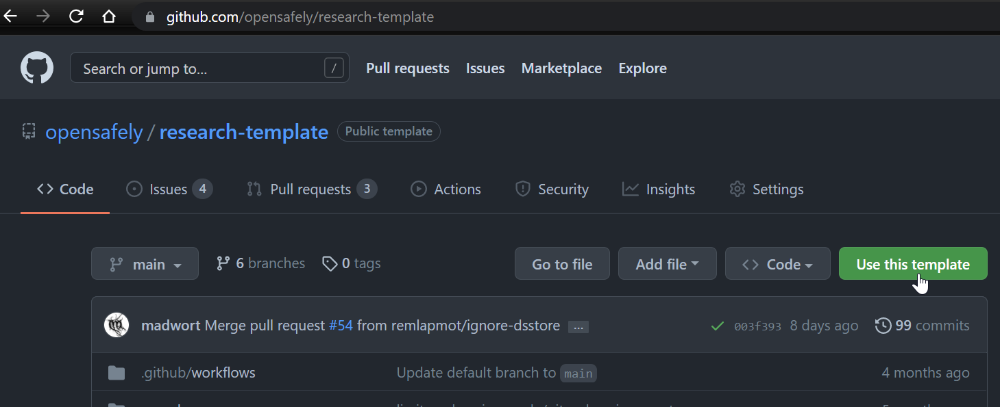

# OpenSAFELY repositories

- OpenSAFELY is a system of Python packages (opensafely and cohortextractor) which run various Docker containers
  - The main GitHub organisation page is [here](https://github.com/opensafely)
  - All the core code is published in their opensafely-core organisation on GitHub [here](https://github.com/opensafely-core)
  - And there is also their opensafely-actions organisation [here](https://github.com/opensafely-actions)
- A Docker container is a like a virtual machine 
  - It defines the operating system and programs running within it
  - On my Windows 10 machine I can run an Ubuntu docker container
  - Just because an R package is installed in the R installation on your machine does not mean that it is installed in the OpenSAFELY R Docker container
    - See the list of packages in the R Docker container [here](https://github.com/opensafely-core/r-docker/blob/master/packages.txt)

## Demo repo

- Have a look at the demo repo [here](https://github.com/opensafely/os-demo-research)

## Getting started

- See OS page [here](https://docs.opensafely.org/getting-started/)
- If creating a new repo create from the OS template [here](https://github.com/opensafely/research-template)
<!-- -->
- This is already Git initialized
- Important files
  - `project.yaml`
    - Defines the jobs and the order in which they run
  - `/analysis/study_defintion.py`
    - Defines the study population extracted from the OpenSAFELY database
    - This should return `.csv` file/s of data to read into R
  - `/analysis/##_R-scripts.R`
    - Your analysis scripts

## Running jobs (on the dummy data) 

- In your OS repo online
  - Use Gitpod
- On your own machine - install the following free software
  - (If on Windows - Windows Subsystem for Linux version 2)
  - Docker Desktop
  - Python
  - Git
  - GitHub Desktop
  - VSCode text editor
