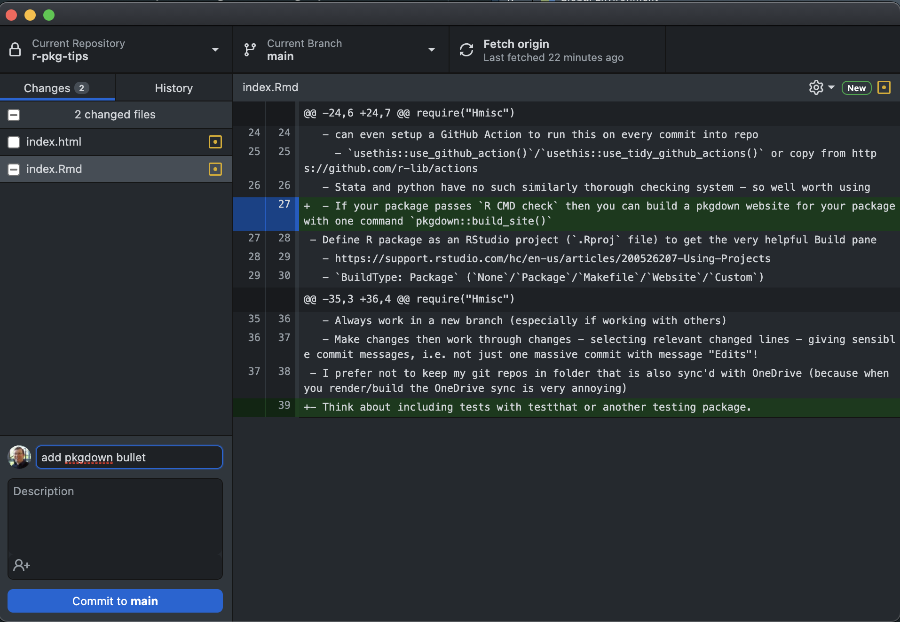
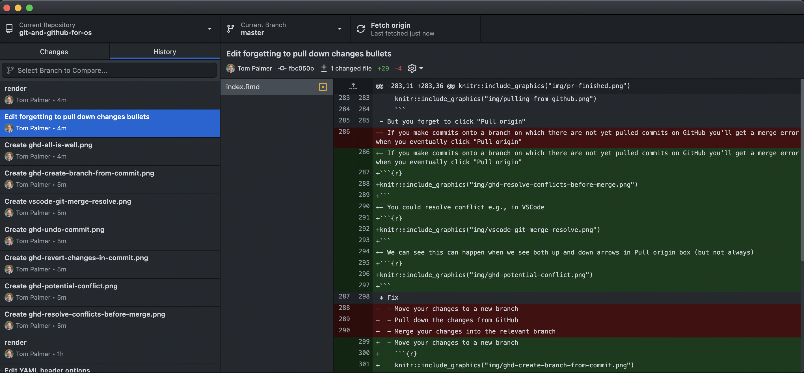
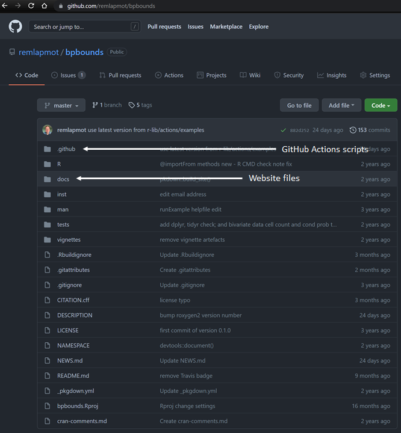

# Additional topics


## Avoid making commits with lots changes
- Do not commit changes to many files with a single commit message such as "Edits"!  

- Note that in a commit we can see the added lines - green highlight with `+` prefix - and deleted lines - red highligh with `-` prefix  


## Writing good commit messages
- Follow the **standard** recommendations about making commit messages, see
  - [here](https://style.tidyverse.org/gitgithub.html) and
  - [here](https://chris.beams.io/posts/git-commit/)

## Files for Git to ignore

- You should not commit all files in the folder on your computer into your repo
- The `.gitignore` file is a list of files and folders in your repo for Git to ignore
- Common files to ignore are
  - `.Rhistory`
  - `.DS_Store`
  - if using an RStudio project ignore the `.Rproj.user` directory with syntax `.Rproj.user/`
- It is helpful to setup a global `.gitignore` file to ignore certain operating system files from all of your repositories, e.g., `.DS_Store` on macOS or `Thumbs.db` on Windows. To do this on macOS, following the example [here](https://stackoverflow.com/a/52678499), we could run the following commands in a shell

    ```bash
    echo ".DS_Store" > ~/.gitignore_global
    git config --global core.excludesfile ~/.gitignore_global
    ```  

## GitHub repos contain more than just code
- A repo for an R package will probably contain
  - The code for the R package
  - The code for its website (often made with pkgdown and hosted with GitHub Pages or Netlify)  
    
  - Scripts for controlling continuous integration services such as GitHub Actions
