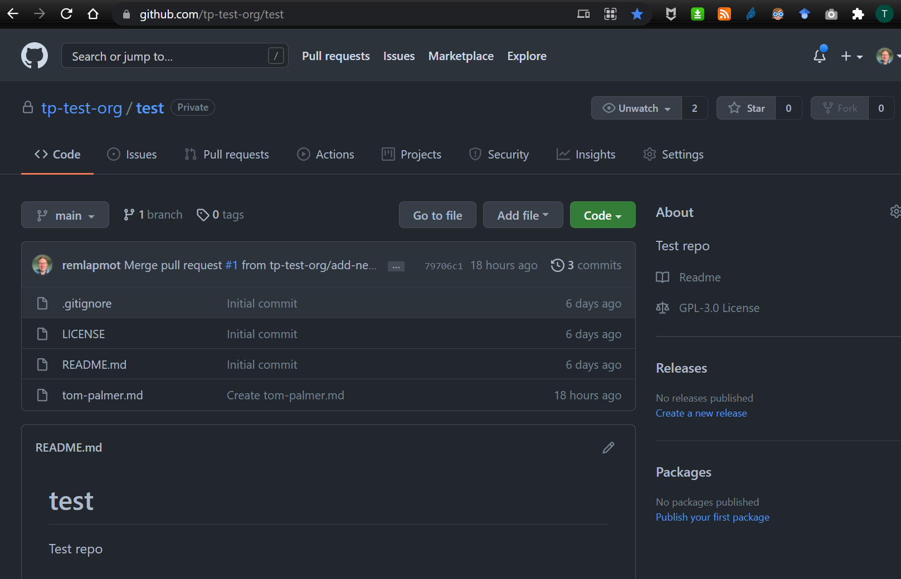
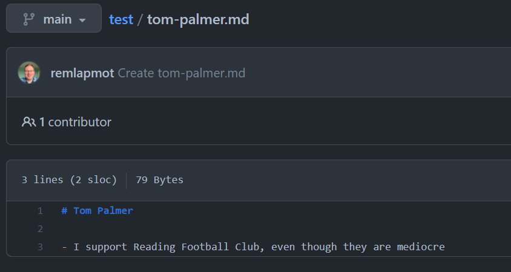

# Short practical

1. On GitHub: 
    a. Go to our test repo (in our test organization) [here](https://github.com/tp-test-org/test)  
    
    a. Clone the repo to your local machine
1. In GitHub Desktop: make a new branch and switch to it
1. In any text editor: 
    a. Create a new markdown file called `yourfirstname-yourlastname.md`
    a. Add a sentence or two to the file about yourself, e.g.,  
    
    a. Save this file into the (top level of the) repo
1. In GitHub Desktop: Commit this new file into your new branch
1. In GitHub Desktop: Push your new branch upto GitHub
1. On GitHub: Open a pull request from your branch to the `main` branch in which you select a reviewer (Tom/Venexia/Elsie) 
1. In your text editor and GitHub Desktop: Make any changes requested by the reviewer and add these to your PR - hopefully your pull request will then be merged by the reviewer!
1. On GitHub: Delete the branch you made your pull request from
1. In GitHub Desktop: Pull down the updated master branch to your machine ... in a real workflow you would then make another new branch and do more work...
