```{r setup, include=FALSE}
knitr::opts_chunk$set(echo = FALSE)
```

## Introduction {.tabset .tabset-pills .tabset-fade}

The following is intended as a set of tips for people learning how to use Git and GitHub.

### Session plan

- Introduction
- Tips
- Short practical on making a pull request
- Elsie - the OpenSAFELY codelist system

### Session aims

By the end of the session you should 

- have a basic understanding of how Git works
- be able to perform common Git operations using GitHub Desktop and the GitHub web interface, including  
  - clone a repo from GitHub
  - make a new branch
  - make commits
  - push your branch to GitHub
  - make a pull request

### Guides to Git and GitHub

There are many excellent guides to Git and GitHub online, e.g.,

-	Intro to GitHub [here](https://guides.github.com/activities/hello-world/)
- GitHub Training & Guides YouTube channel [here](https://www.youtube.com/githubguides)
- Git documentation and training [here](https://git-scm.com/doc)
- Hadley Wickham on Git [here](https://r-pkgs.org/git.html)
- Jenny Bryan on Git and GitHub with R [here](https://happygitwithr.com/)

And most relevantly the OpenSAFELY documentation [here](https://docs.opensafely.org/getting-started/).

These tips are meant to supplement them.

## Tips {.tabset .tabset-pills .tabset-fade}

### Intro to Git

- Git was written to allow developers work on the source code of the Linux kernel (text files)
  - One kernel release they got in a terrible mess
  - This provoked Linus Torvalds into action
  - For an excellent insight into his thinking watch this talk he gave at Google [here](https://youtu.be/4XpnKHJAok8)  
  - (Especially if used at the command line) Git can be intimidating to use and we can get Git errors (which like LaTeX and R errors can be quite cryptic)  
    ```{r, out.width = "50%"}
    knitr::include_graphics("https://imgs.xkcd.com/comics/git.png")
    ```  
- A Git repository is a folder/directory on your computer which has been Git initialised 
  - Using either the command line  
    ```
    git init mynewfolder
    ```  
  - Or GitHub Desktop  
    ```{r, out.width = "50%"}
    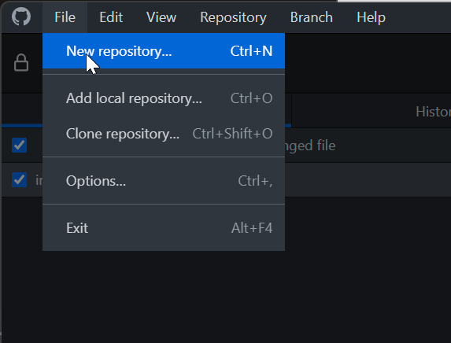
    ```
  - Repos on GitHub are already Git initialised 
    - When you clone them down to your computer they work in GitHub Desktop
- Git is commonly referred to as version control software
- Git is better described as a *content addressable filesystem* which translates to *Git tracks the contents of the files in your repo*
  - Git creates a little database of the contents of your files - snapshots (commits) are taken when you tell it to
  - Git looks for changes in your files when you save them, so when you have unsaved changes in a file/s Git shows no changes until you save  
    ```{r}
    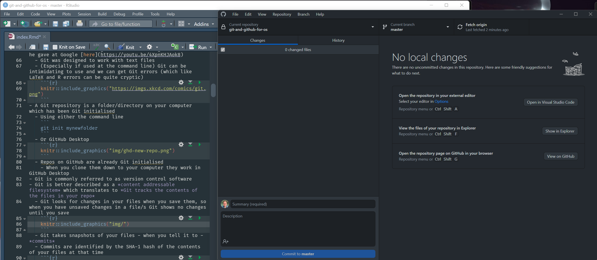
    ```  
  - Git takes snapshots of your files - when you tell it to - *commits* - I saved my file from above, enter a commit message and click "Commit to master"
    ```{r}
    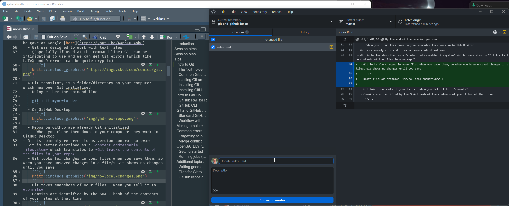
    ```  
  - Commits are identified by the 40-character checksum SHA-1 hash of the contents of your files at that time  
    ```{r}
    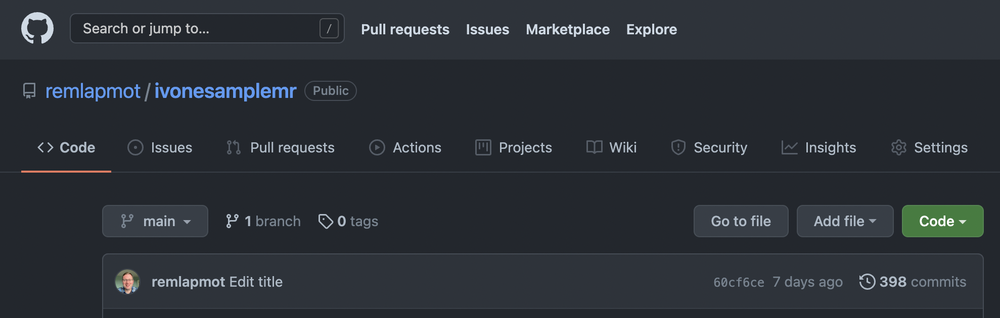
    ```  
    
    ```{r}
    knitr::include_graphics("img/git-commit-hash-2.png")
    ```  
    
    ```{r}
    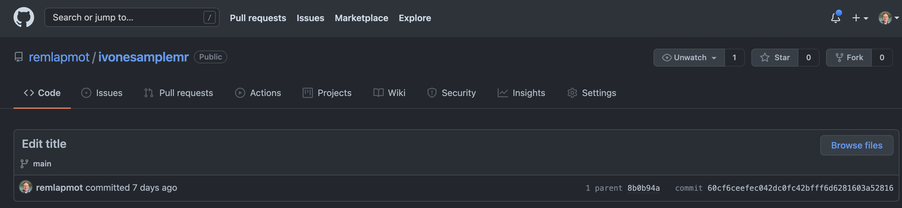
    ```  
  - Git knows the state of your files at every commit
    - You can easily restore your files to a previous state
  - For Git the state of your files only changes when their contents change
    - If you reopen a file, make no changes, then close it, Git will show no changes in your repo
    - If you add an empty folder/directory to your repo Git will show no changes in your repo
    - This differs to OneDrive/SharePoint/Google Drive which are file synchronisation systems
  - I recommend not to place your Git repos in a location that is sync'd by either OneDrive or Google Drive

#### The `.git` folder

- When you initialise a directory the `.git` folder is created
- This contains all of the files Git uses to track the contents of your files
- Here is the `.git` folder of a repo on my computer (I have selected to View hidden files in Windows Explorer)  
```{r, out.width = "50%"}
knitr::include_graphics("img/windows-explorer-repo.png")
```  
- Confusingly GitHub hides the `.git` folder from view  
```{r}
knitr::include_graphics("img/repo-github-view.png")
```  
- Here are its contents - don't edit these manually  
```{r, out.width = "50%"}
knitr::include_graphics("img/dot-git-folder-contents.png")
```  
- Explanation of these is (from [here](https://www.tutorialspoint.com/what-is-git-folder-and-why-is-it-hidden))  
```{r}
knitr::include_graphics("img/dot-git-folder-explanation.png")
```  

#### Common Git commands

- I recommend you use GitHub Desktop instead of these commands
- These commands are what GitHub Desktop is using behind the scenes
- Git is the name of the program, `git` is the name of the executable available at your command line  

    ```
    git init 
    git add <filename>
    git status
    git commit -m "Your commit message"
    git commit --amend -m "Your amended commit message"
    git push 
    git pull 
    git clone
    git branch
    git checkout
    git merge
    git fetch 
    ```  

### Installing Git and GitHub Desktop

#### Installing Git

- Windows
  - Download and install from [here](https://git-scm.com/download/win)
- macOS comes with an out-dated version of Git
  - I recommend installing the Homebrew version 
  - First install Homebrew, see instructions [here](https://brew.sh/)
  - Then run in your Terminal app  
    ```
    brew upgrade
    brew install git
    ```  
  - Additionally on a Mac it is helpful to install Xcode command line tools (i.e., avoid installing the whole of Xcode.)    
    ```
    xcode-select --install
    ```  
    - Must reinstall these everytime upgrade operating system versions, e.g., from Big Sur to Monterey
- Once Git is installed its executable (called `git`) should be available at your command line
  - Check which version you have with (you want something recent-ish)  
    ```
    git --version
    ```  
  - On my Windows machine I have  
    ```
    git version 2.33.1.windows.1
    ```  

#### Installing GitHub Desktop

- You could use Git through its command syntax however I recommend you use a graphical Git program
- For Windows and macOS download and install GitHub Desktop from [here](https://desktop.github.com/)
- A Linux version of GitHub Desktop is available from [here](https://github.com/shiftkey/desktop/)
- I recommend installing the free VSCode text editor, from [here](https://code.visualstudio.com/), and setting that as the "External editor" in GitHub Desktop options (Click: File | Options...)  
```{r, out.width = "65%"}
knitr::include_graphics("img/ghd-options-vscode.png")
```  
- On Windows I also recommend installing Windows Terminal from [here](https://www.microsoft.com/store/productId/9N0DX20HK701)

### Intro to GitHub

- GitHub is a Git web server, there are others e.g., [GitLab](https://about.gitlab.com/)
- Your repositories will be stored on GitHub, and you will clone them to your machine to work on them (or work on them in Gitpod)
- Under your user account you see the repos you are owner of

- On GitHub OpenSAFELY is an organization
  - The repos are owned by the organization so they show up under the organisation [here](https://github.com/opensafely)
    ```{r}
    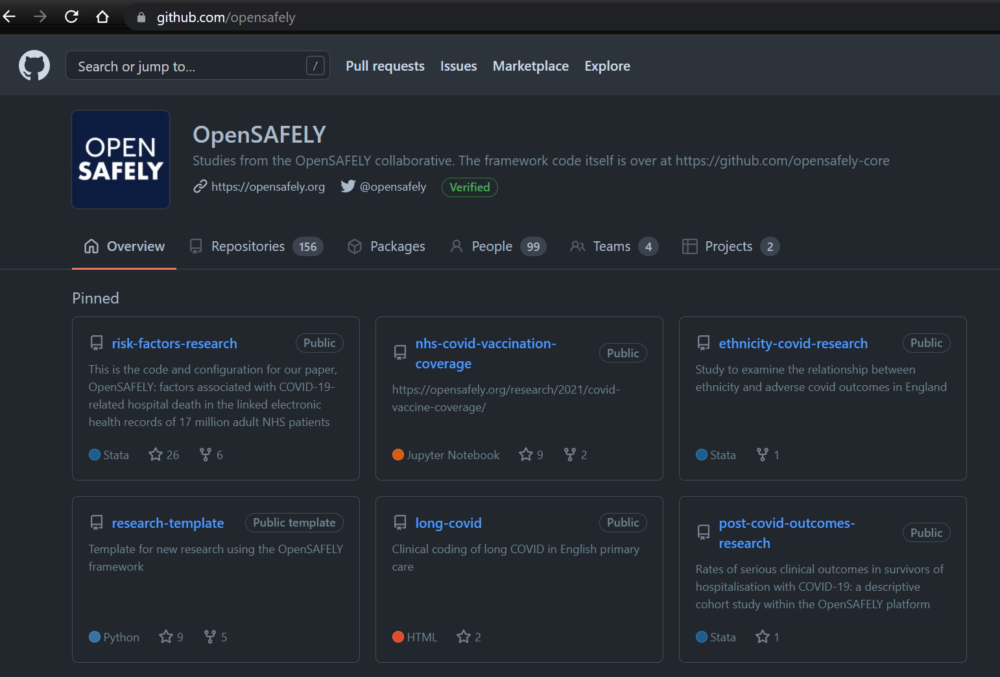
    ```  

#### GitHub PAT for R

- To create a GitHub Personal Access Token (PAT) to be allowed more downloads from GitHub per hour run in R  
```{r, echo=TRUE, eval=FALSE}
install.packages("usethis")
library(usethis)
create_github_token()
```

#### GitHub CLI

- GitHub CLI stands for command line interface for operating GitHub
- Installation instructions are [here](https://github.com/cli/cli#readme)
- But I don't recommend using this

### Git and GitHub Workflow

#### Standard GitHub workflow

- (I recommend to only fork a public repo if you intend to send a pull request to it)
- Fork the other person's repo (this will be known as the `upstream` repo from your fork, your copy of a repo on GitHub is known as `origin`)
- This creates a copy of their repo under your account (your fork)
- Clone your fork (the copy under your account) to your machine
- Create a new branch (do not work on `master`/`main`)
- Make your changes and commit them
- Push your new branch upto your GitHub (i.e., to your fork)
- Create a pull request (from your new branch) back to the default (`master`/`main`) branch of the original repo

#### Workflow with an OpenSAFELY GitHub repo

- Skip the forking step from the standard GitHub workflow
- The repo on GitHub is known as `origin`
- Clone the repo to your local machine
  - Click: `Code` | `Open with GitHub Desktop`  
    ```{r}
    knitr::include_graphics("img/tp-test-org_test-code-button-owgd.png")
    ```  
  - Click `Clone` in the box which appears in GitHub Desktop  
    ```{r, out.width = "65%"}
    knitr::include_graphics("img/gd-clone-box.png")
    ```  
  - Go to making a pull request tab

### Making a pull request

- Let's start by creating a new branch  
```{r}
knitr::include_graphics("img/pr-new-branch.png")
```  
- We do some work (in VSCode/text editor/RStudio) which creates a markdown file with a title and some text. We then make a new commit which adds this new file to the repo  
```{r}
knitr::include_graphics("img/pr-commit-new-file.png")
```  
- Next publish the new branch to GitHub  
```{r}
knitr::include_graphics("img/pr-publish-branch.png")
```  
- Now initiate the creation of the PR by either clicking in GitHub Desktop "Create Pull Request" 
```{r}
knitr::include_graphics("img/pr-create-pr-01.png")
```  
- or clicking on the button on the repo webpage "Compare & pull request"  
```{r}
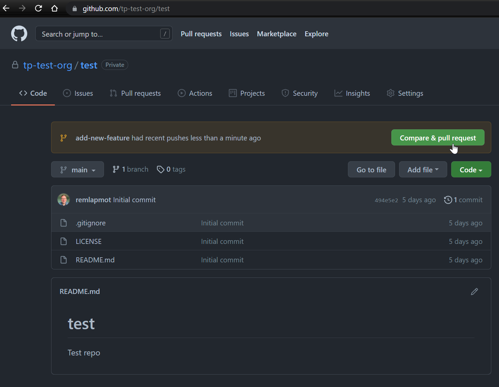
```  
- Edit the title box, add some extra text in the comment box, select a reviewer, and then click "Create pull request"  
```{r}
knitr::include_graphics("img/pr-create-pr-and-reviewers.png")
```  
- You can amend/edit pull requests by modifying/adding commits to the branch from which you sent the PR
- See more about pull request reviews [here](https://docs.github.com/en/github/collaborating-with-pull-requests/reviewing-changes-in-pull-requests/about-pull-request-reviews)
- (The reviewer) will then merge your PR  
```{r}
knitr::include_graphics("img/pr-merge-pr.png")
```  
- (The reviewer) will then confirm the merge  
```{r}
knitr::include_graphics("img/pr-confirm-merge.png")
```  
- (Optional) Delete the branch the PR came from  
```{r}
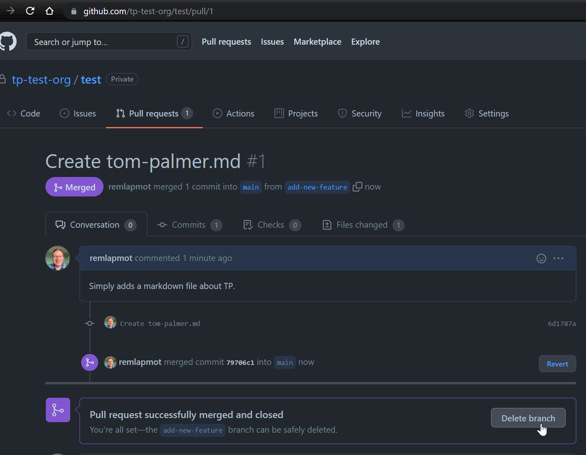
```  
- The PR is now finished and we can see the merge commit in the default (`main`/`master`) branch
```{r}
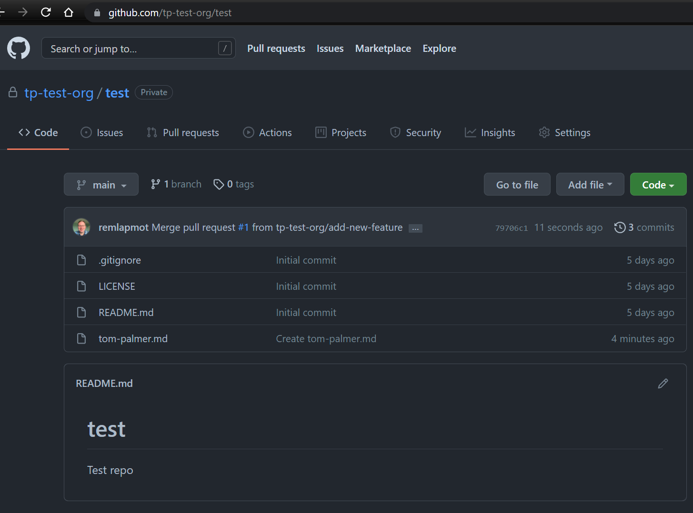
```  
- In GitHub Desktop click "Fetch origin"/"Pull origin" to pull the updated `main`/`master` branch down to your local machine ... and the process begins again ...

### Merging a branch locally

- A PR is essentially doing a merge on GitHub, you can merge branches locally as well
- Say we created a new branch `edit-readme` and made a commit on it
- To merge `edit-readme` into `main` switch to `main`  
```{r}
knitr::include_graphics("img/merge-into-current-branch.png")
```  
- Select `edit-readme` and click "Create a merge commit"
```{r}
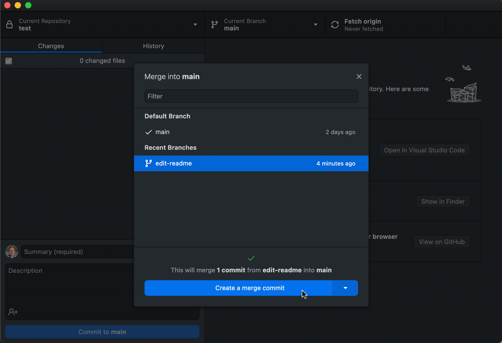
``` 
- Then push the new commits onto `main` upto GitHub (when appropriate)
```{r}
knitr::include_graphics("img/post-merge-push-origin.png")
```  
- Then you can delete the `edit-readme` branch  
```{r}
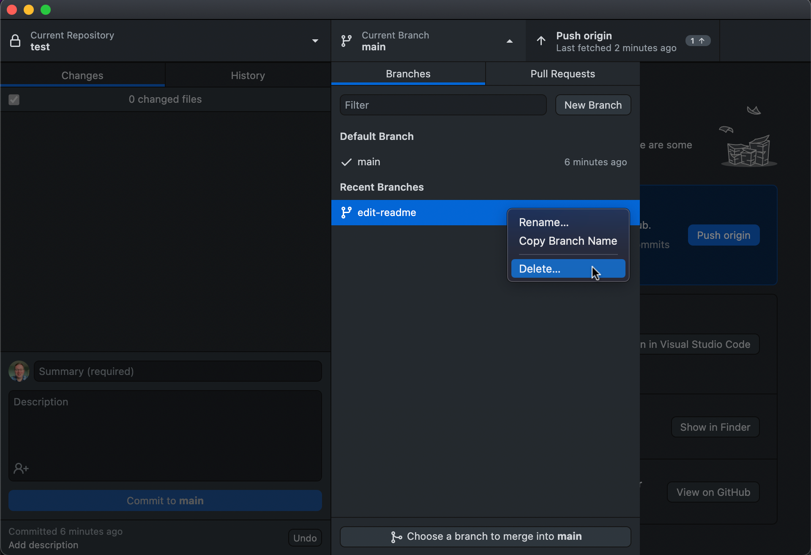
```  
- Confirm the deletion
```{r}
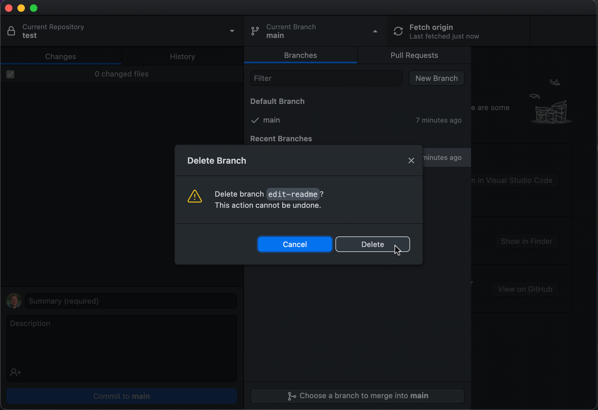
```  

### Common errors

#### Merge conflicts

* These can happen if e.g., 
  - you forget to pull down the latest changes from GitHub (I find easy to forget in the morning)
  - if you're working on a project with mutiple people
    - you both create new branches
    - they send in their PR first and its merged
    - then you send in your PR which edits some of the same lines
* Let's say I made changes yesterday which I pushed to GitHub
  - The next day I restart work on a different computer, GitHub Desktop will show for example  
    ```{r}
    knitr::include_graphics("img/pulling-from-github.png")
    ```  
- But you forget to click "Pull origin"
- If you make commits onto a branch on which there are not yet pulled commits on GitHub you'll get a merge error when you eventually click "Pull origin"  
```{r}
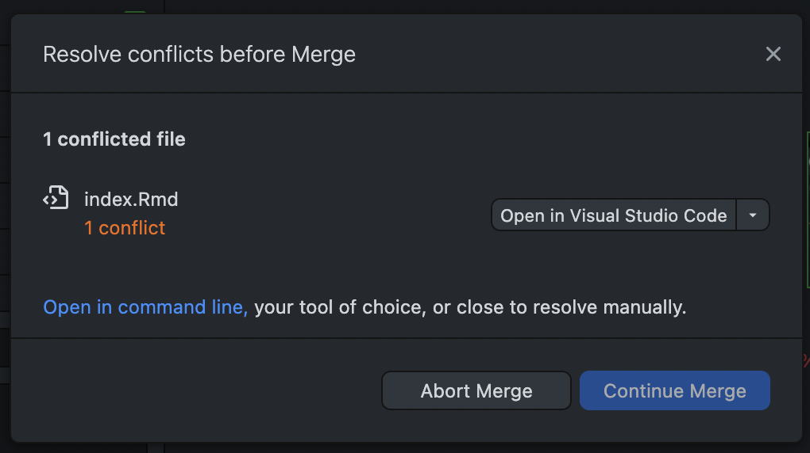
```  
- You could resolve conflict e.g., in VSCode  
```{r}
knitr::include_graphics("img/vscode-git-merge-resolve.png")
```  
- We can see this can happen when we see both up and down arrows in Pull origin box (but not always)  
```{r}
knitr::include_graphics("img/ghd-potential-conflict.png")
```  
* Fix
  - Move your changes to a new branch  
    ```{r}
    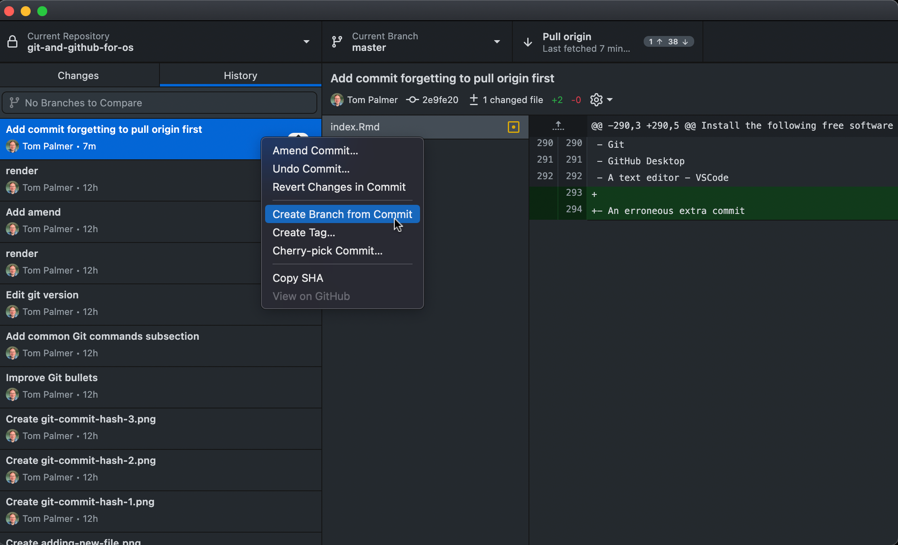
    ```  
  - Move back to `master`/`main` and revert/undo the changes there, then edit the files so they show no changes  
    ```{r}
    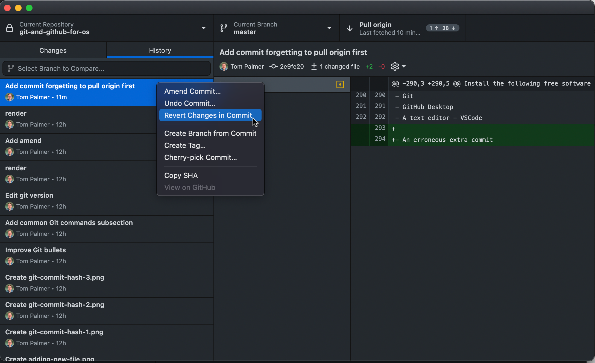
    ```  
    
    ```{r}
    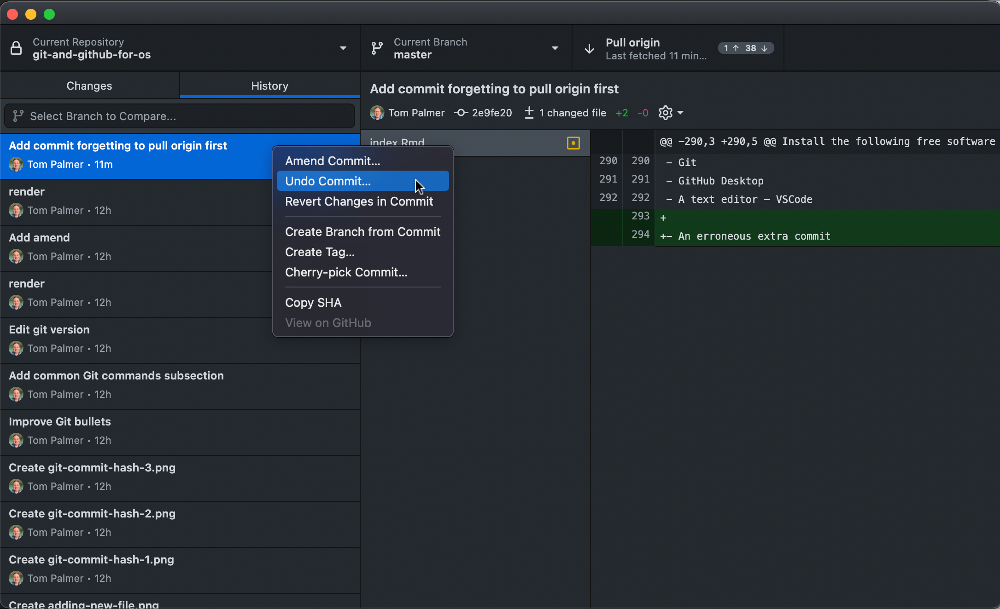
    ```  
  - Pull down the changes from GitHub to the relevant branch  
    ```{r}
    knitr::include_graphics("img/ghd-all-is-well.png")
    ```  
  - Merge changes from your new branch into the `main`/`master`/relevant branch
- See the GitHub documentation for more information about merge conflicts
  - [here](https://docs.github.com/en/github/collaborating-with-pull-requests/addressing-merge-conflicts/about-merge-conflicts)
  - Resolving a merge conflict [here](https://docs.github.com/en/github/collaborating-with-pull-requests/addressing-merge-conflicts/resolving-a-merge-conflict-on-github)

### Installing Python and the opensafely python command line interface

- Environment variables in computer operating systems contain important strings of text
- The `PATH` environment variable is a list of folders which the computer searches in when you type the name of an executable into the command line shell program (usually `zsh` on macOS, `bash` on Ubuntu, `cmd` or `Powershell` on Windows)
- To use the `python`/`python3` and `pip`/`pip3` commands at the shell command line we need to install Python and make sure the folder containing its executable is in our `PATH` environment variable (unless you already know all of this and are going to run Python in Anaconda through the Anaconda Prompt)

#### macOS

- If you have a Mac, the macOS operating system comes with an old-ish version of Python 2.7
- I recommend installing Python 3 through [homebrew](https://brew.sh/)  
    ```
    brew install python
    ```  
- When you open Terminal 
  - See the contents of `PATH` with `echo $PATH` (note use `${PATH}` in shell scripts)
  - you should be able to find the `python`/`python3` exectables with the `which` command
    ```{r}
    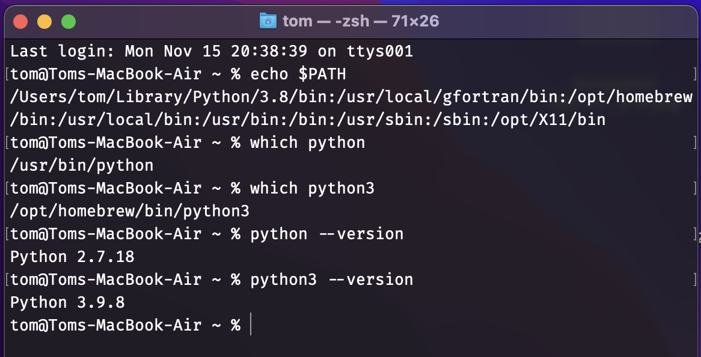
    ```  

#### Windows

- You have a number of choices where to install Python from  
  - Microsoft store, .e.g. Python 3.10 from [here](https://www.microsoft.com/store/productId/9PJPW5LDXLZ5)
  - Python installer from [here](https://www.python.org/downloads/)
  - Anaconda installer from [here](https://www.anaconda.com/products/individual)
- Despite not being recommend - it is better for you to add Anaconda/Python to your `PATH` in the installer options, i.e., check the first box on this screen  
    ```{r}
    knitr::include_graphics("img/anaconda-win-install-options.png")
    ```  
  - And in the Python check the box adding Python to `PATH`  
    ```{r}
    knitr::include_graphics("img/install-python-add-to-path.png")
    ```  
- Open Windows Terminal
  - you can see the contents of `PATH` in Powershell with `$Env:Path`  
    ```{r}
    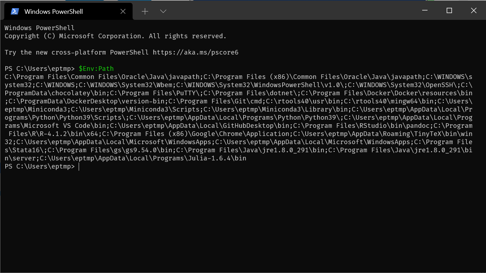
    ```  
  - and in `cmd` with `echo %PATH%`  
    ```{r}
    knitr::include_graphics("img/windows-cmd-path.png")
    ```  
  - you can see the location of the Python executable in `cmd` with `where python`/`where python3`  
    ```{r}
    knitr::include_graphics("img/windows-cmd-where-python3.png")
    ``` 

#### Installing the opensafely package

- As long as the `python`/`python3` and `pip`/`pip3` executables are now on your `PATH` you can simply run in your shell program  
    ```
    pip install opensafely   
    ```  
- This will additionally install its dependency package the cohortextractor package into your Python installation and you should now be able to run opensafely commands such as  
    ```
    opensafely run run_all
    ```  

### OpenSAFELY repositories

- OpenSAFELY is a system of Python packages (opensafely and cohortextractor) which run various Docker containers
  - The main GitHub organisation page is [here](https://github.com/opensafely)
  - All the core code is published in their opensafely-core organisation on GitHub [here](https://github.com/opensafely-core)
  - And there is also their opensafely-actions organisation [here](https://github.com/opensafely-actions)
- A Docker container is a like a virtual machine 
  - It defines the operating system and programs running within it
  - On my Windows 10 machine I can run an Ubuntu docker container
  - Just because an R package is installed in the R installation on your machine does not mean that it is installed in the OpenSAFELY R Docker container
    - See the list of packages in the R Docker container [here](https://github.com/opensafely-core/r-docker/blob/master/packages.txt)

#### Demo repo

- Have a look at the demo repo [here](https://github.com/opensafely/os-demo-research)

#### Getting started

- See OS page [here](https://docs.opensafely.org/getting-started/)
- If creating a new repo create from the OS template [here](https://github.com/opensafely/research-template)
```{r}
knitr::include_graphics("img/os-template.png")
```  
- This is already Git initialized
- Important files
  - `project.yaml`
    - Defines the jobs and the order in which they run
  - `/analysis/study_defintion.py`
    - Defines the study population extracted from the OpenSAFELY database
    - This should return `.csv` file/s of data to read into R
  - `/analysis/##_R-scripts.R`
    - Your analysis scripts

#### Running jobs (on the dummy data) 

- In your OS repo online
  - Use Gitpod
- On your own machine - install the following free software
  - (If on Windows - Windows Subsystem for Linux version 2)
  - Docker Desktop
  - Python
  - Git
  - GitHub Desktop
  - VSCode text editor

### Additional topics

#### Avoid making commits with lots changes
- Do not commit changes to many files with a single commit message such as "Edits"!  
```{r}
knitr::include_graphics("img/github-desktop-select-lines.png")
```  
- Note that in a commit we can see the added lines - green highlight with `+` prefix - and deleted lines - red highligh with `-` prefix  
```{r}
knitr::include_graphics("img/changes-in-a-commit.png")
```  

#### Writing good commit messages
- Follow the **standard** recommendations about making commit messages, see
  - [here](https://style.tidyverse.org/gitgithub.html) and
  - [here](https://chris.beams.io/posts/git-commit/)

#### Files for Git to ignore

- You should not commit all files in the folder on your computer into your repo
- The `.gitignore` file is a list of files and folders in your repo for Git to ignore
- Common files to ignore are
  - `.Rhistory`
  - `.DS_Store`

#### GitHub repos contain more than just code
- A repo for an R package will probably contain
  - The code for the R package
  - The code for its website (often made with pkgdown and hosted with GitHub Pages or Netlify)  
    ```{r, out.width = "90%"}
    knitr::include_graphics("img/bpbounds-with-explanation.png")
    ```  
  - Scripts for controlling continuous integration services such as GitHub Actions

### Short practical

1. On GitHub: 
    a. Go to our test repo (in our test organization) [here](https://github.com/tp-test-org/test)  
    ```{r}
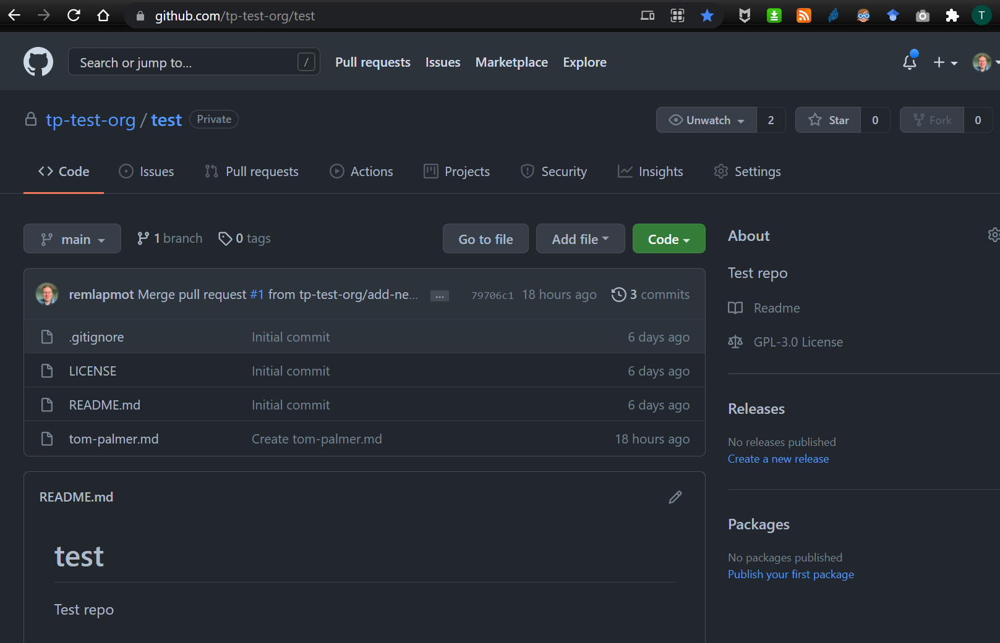
    ```  
    a. Clone the repo to your local machine
1. In GitHub Desktop: make a new branch and switch to it
1. In any text editor: 
    a. Create a new markdown file called `yourfirstname-yourlastname.md`
    a. Add a sentence or two to the file about yourself, e.g.,  
    ```{r, out.width = "65%"}
    knitr::include_graphics("img/tom-palmer-md.png")
    ```  
    a. Save this file into the (top level of the) repo
1. In GitHub Desktop: Commit this new file into your new branch
1. In GitHub Desktop: Push your new branch upto GitHub
1. On GitHub: Open a pull request from your branch to the `main` branch in which you select a reviewer (Tom/Venexia/Elsie) 
1. In your text editor and GitHub Desktop: Make any changes requested by the reviewer and add these to your PR - hopefully your pull request will then be merged by the reviewer!
1. On GitHub: Delete the branch you made your pull request from
1. In GitHub Desktop: Pull down the updated master branch to your machine ... in a real workflow you would then make another new branch and do more work...
