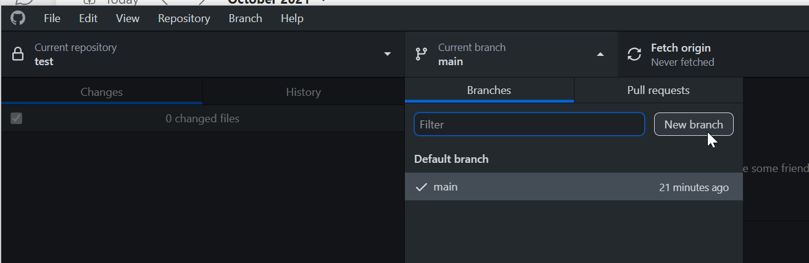

```{r setup, include=FALSE}
# require("Hmisc")
knitr::opts_chunk$set(echo = FALSE)
```

<!-- `r Hmisc::hidingTOC(levels = 2)` -->

## Introduction

The following is intended as a set of tips for people learning how to use Git and GitHub.

There are many excellent guides to Git and GitHub online, e.g.,

-	Intro to GitHub https://guides.github.com/activities/hello-world/
- GitHub videos https://www.youtube.com/githubguides
- Hadley Wickham https://r-pkgs.org/git.html
- Jenny Bryan - Git and GitHub with R https://happygitwithr.com/

And most relevantly the OpenSAFELY documentation [here](https://docs.opensafely.org/getting-started/)

These tips are meant to supplement them.

## Tips {.tabset .tabset-pills .tabset-fade}

### Intro to Git

- Git was written to allow developers work on the source code of the Linux kernel
  - One kernel release they got in a terrible mess emailing compressed archives of the source code to each other
  - This provoked Linus Torvalds into action
  - Git was designed to work with text files
  - (Especially if used at the command line) Git can be intimidating to use and we can get Git errors (which like LaTeX and R errors can be quite cryptic)  
    ```{r}
    knitr::include_graphics("https://imgs.xkcd.com/comics/git.png")
    ```  
- A Git repository is simply a folder/directory on your computer which has been Git initialised
- Git is commonly referred to as version control software
- Git is better described as *content tracking software*
  - Git takes the cryptographic hash of the contents of your files (when you tell it to)
  - Git does not care about when your file was last saved
  - Git cares about the contents of your files
  - Git does not care about empty directories/folders
    - If you add an empty folder/directory to your repo Git will detect no changes in your repo
  - This differs to OneDrive/SharePoint/Google Drive which are file synchronisation systems

#### The `.git` folder

- When you initialise a directory the `.git` folder is created
- This contains all of the files Git uses to track the contents of your files
- Confusingly GitHub hides the `.git` folder from view 
- Here is the `.git` folder of a repo on my computer (I have selected to View hidden files in Windows Explorer)  
```{r}
knitr::include_graphics("img/windows-explorer-repo.png")
```  
- We see it's omitted from the GitHub web interface  
```{r}
knitr::include_graphics("img/repo-github-view.png")
```  
- Here are its contents - never edit these manually  
```{r}
knitr::include_graphics("img/dot-git-folder-contents.png")
```  

### Installing Git

- Windows
  - Download and install from [here](https://git-scm.com/download/win)
- macOS comes with an out-dated version of Git
  - I recommend installing the Homebrew version 
  - First install Homebrew, see instructions [here](https://brew.sh/)
  - Then run in your Terminal app  
    ```
    brew upgrade
    brew install git
    ```  
  - Additionally on a mac it doesn't hurt to install Xcode command line tools (i.e., avoid installing the whole of Xcode)  
    ```
    xcode-select --install
    ```  

### Installing GitHub Desktop

- You could use Git through its command syntax however I recommend you use a graphical git editor
- For Windows and macOS download and install GitHub Desktop from [here](https://desktop.github.com/)
- Linux version of GitHub Desktop available from [here](https://github.com/shiftkey/desktop/)

### Files to ignore

- You should not commit all files into your repo
- The `.gitignore` file is a list of files and folders for Git to ignore
- Common files to ignore are
  - `.Rhistory`
  - `.DS_Store`
- I recommend not placing your Git repos in a location that is sync'd by either OneDrive or Google Drive - they are very different syncing technologies to Git

### Intro to GitHub

- GitHub is a Git web server, there are others e.g., [GitLab](https://about.gitlab.com/)
- You will sync your repositories between your local machine and GitHub

#### GitHub PAT for R

- To create a GitHub Personal Access Token (PAT) to be allowed more downloads from GitHub per hour run in R  
```{r, echo=TRUE, eval=FALSE}
install.packages("usethis")
library(usethis)
create_github_token()
```

#### GitHub CLI

- CLI stands for command line interface for operating GitHub
- Installation instructions are [here](https://github.com/cli/cli#readme) but I don't recommend using this

### Workflow

#### Standard GitHub workflow

- Only fork a public repo if you intend to send a pull request back to it
- Fork the other person's repo
- Clone it to your machine
- Create a new branch (do not work on `master`/`main`)
- Make your changes and commit them
- When finished push your new branch upto your GitHub (i.e., to your fork)
- Create pull request (from your new branch) back to the default (`master`/`main`) branch of the original repo

#### Workflow with an OpenSAFELY GitHub repo

- You skip the fork step from the standard GitHub workflow
- Clone the repo to your local machine
  - Click: `Code` | `Open with GitHub Desktop`  
```{r}
knitr::include_graphics("img/tp-test-org_test-code-button-owgd.png")
```
- Click `Clone` in the box which appears in GitHub Desktop  
```{r}
knitr::include_graphics("img/gd-clone-box.png")
```
- In GitHub Desktop (i.e. locally) make a new branch  
```{r}

```
- Do some work
  - I recommend making your changes 
  - In GitHub Desktop select relevant changed lines and make small-ish commits with sensible commit messages
  - Do not commit changes to many files with a single commit message such as "Edits"!  
```{r}
knitr::include_graphics("img/github-desktop-select-lines.png")
```  
- Push your new branch upto GitHub
- Make a pull request from your branch to the default branch

### Final thoughts

#### Good commit messages
- Follow the **standard** recommendations about making commit messages, see
  - [here](https://style.tidyverse.org/gitgithub.html) and
  - [here](https://chris.beams.io/posts/git-commit/)

#### GitHub repos contain more than just code
- A repo for an R package will probably contain
  - The code for the R package
  - The code for its website (often made with pkgdown and hosted with GitHub Pages or Netlify)  
    ```{r}
    knitr::include_graphics("img/bpbounds-with-explanation.png")
    ```  
  - Scripts for controlling continuous integration services such as GitHub Actions
